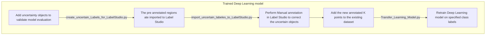

# Active-Learning-and-Human-in-the-loop-Machine-Learning
The Project show cases the Active Learning for deep learning and Human in the Loop Machine Learning. This work was carried out Fraunhofer Institute for Integrated Circuits IIS, Division Engineering of Adaptive Systems EAS located in Dresden

# Use case:
The uncertainty in deep learning models is divided into aleotric and epsitemic uncertainities, the uncertainty metric is not taken into account and it is hard to interpret the models prediction. The main goal of the Active Learning algorithm is to iteratively seek the most informative samples points and add it to the training dataset. 
Steps in Active Learning is described in the follwing figure 

## Confidentiality Agreement
Owing to the confidentiality agreement and NDA the necessary scripts and resuts are not enclosed in the repository. But to summarise the overall work a Mermaid diagrams is desribed below.

